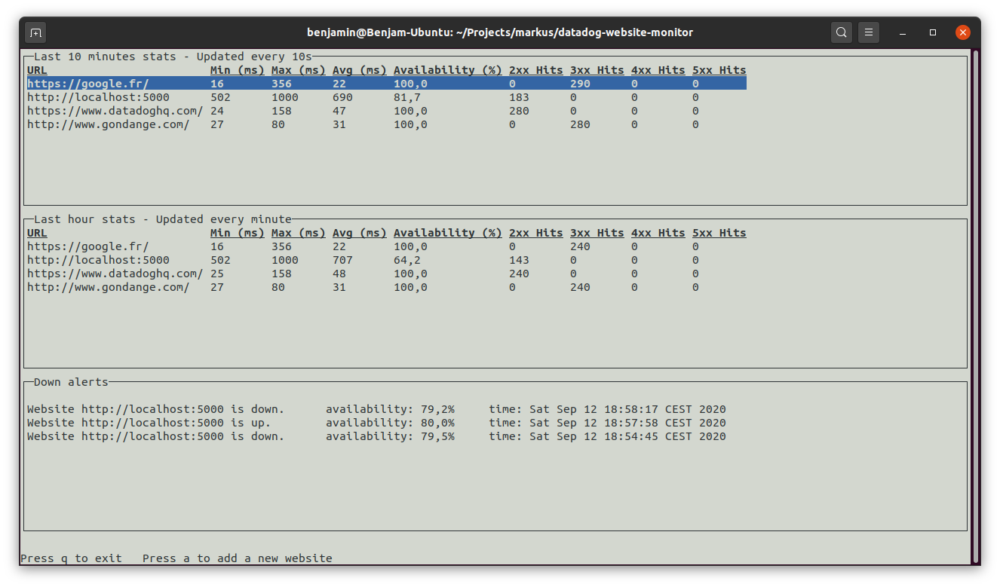

# Website availability & performance monitoring

## Requirements

> ## Overview

> * Create a console program to monitor performance and availability of websites

> * The user can define which websites are checked and at what intervals

> * Users can keep the console app running and monitor the websites

> ## Stats
> * Check the different websites with their corresponding check intervals
>   * Compute a few interesting metrics: availability, max/avg response times, response codes count and more...

> * Every 10s, display the stats for the past 10 minutes for each website

> * Every minute, displays the stats for the past hour for each website

> ## Alerting

> * When a website availability is below 80% for the past 2 minutes, add a message saying that "Website {website} is down. availability={availability}, time={time}"

> * When availability resumes for the past 2 minutes, add another message detailing when the alert recovered

> * Make sure all messages showing when alerting thresholds are crossed remain visible on the page for historical reasons

> ## Tests & question

> * Write a test for the alerting logic

> * Explain how you'd improve on this application design

## How to run it

This project requires **Java 11 Runtime** installed.

To run it, launch this command in a terminal:

`java -jar wsmonitor.jar`

## Fake server

To test this application, I built a small [Slow server](https://gist.github.com/gondyb/19e72e601e72b654af1b02d59d8db833) in Python.
Its availability percentage is around 60%, thus it makes a great candidate for real-life testing.

# To improve

* The date/time values from the alarms table should be taken from the event, instead of the date/time of writing.

* Instead of using one AlarmDetector, I should create one per website, this should make the code more readable and maintainable.

* The alert detection part could use an error percentage, so that alarm events are not triggered everytime the availability goes up or down 80%.

* The UI is not very clean, and the terminal needs to be quite large to see every statistic, this could be improved by changing the layout completely.

* It would be great to remove websites from the monitoring list.

* A configuration file could be added to edit important variables. For instance the availability threshold, or the statistics period.

* The test coverage could be improved.

* Unfortunately, the lib used to run mock tests does not support parameterized tests. If I had more time, I would have found a way to write parameterized tests for the availability calculator part.